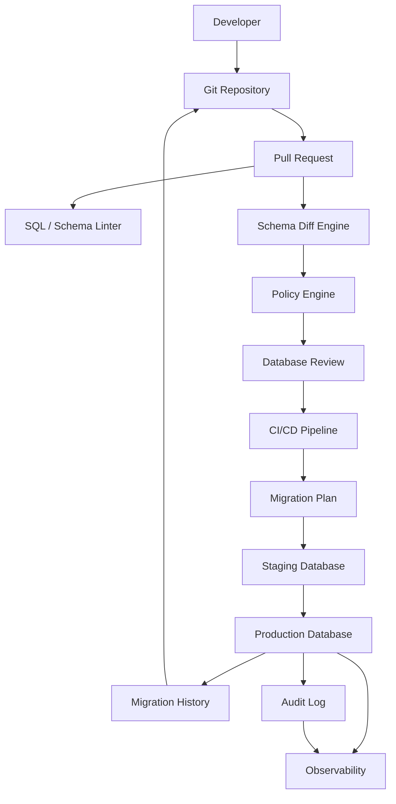
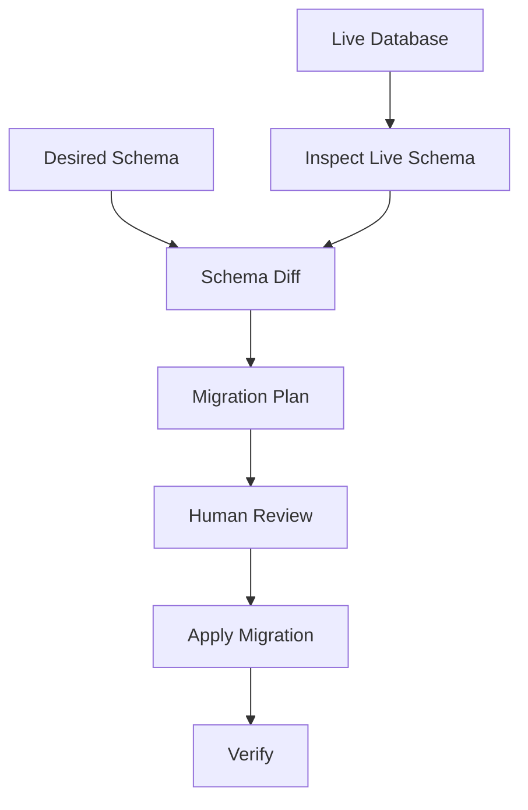
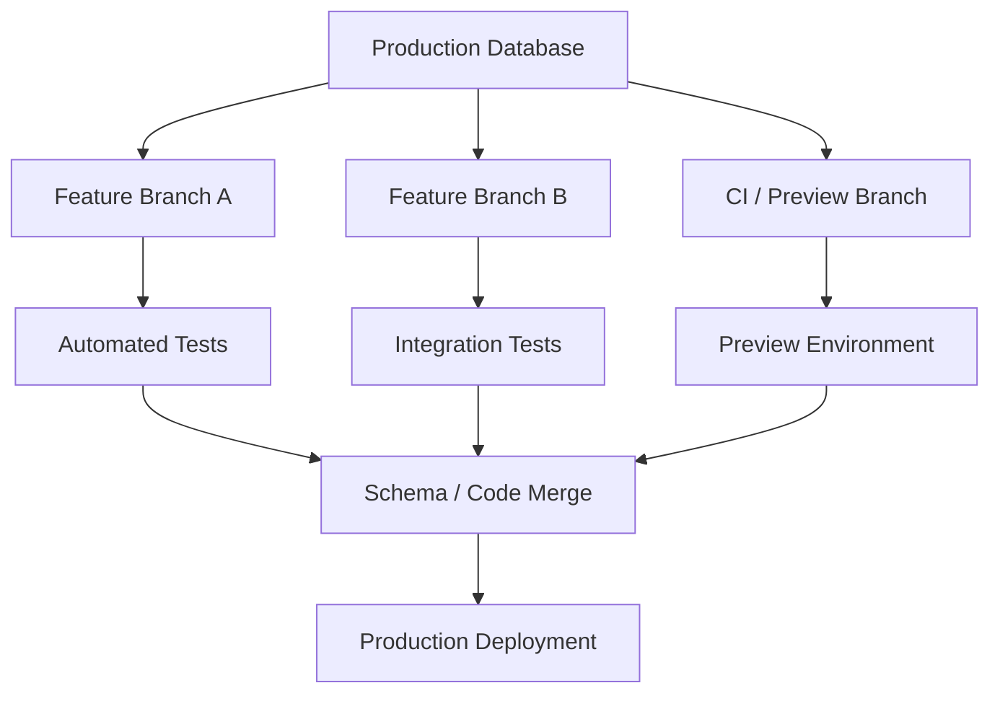
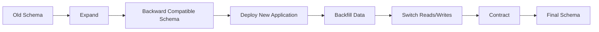
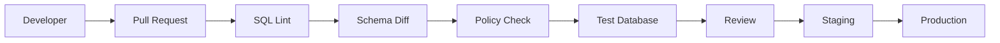

# Awesome-Schema-Migration-Platform

## Top Schema Migration Platforms


**A comprehensive ecosystem of database schema migration, schema-as-code, database branching, change automation and database DevOps platforms**


*Open-source-first reference covering versioned migrations, declarative schema management, ORM migrations, schema diffing, zero-downtime changes, branching and database change governance.*


**Last updated: September 2026**


Database schema migration platforms help engineering teams safely evolve database structures across development, testing, staging and production environments. They provide mechanisms for versioning schema changes, generating or applying DDL, tracking migration history, detecting drift, reviewing changes, automating deployments and, increasingly, creating isolated database branches.


Examples include **Liquibase, Flyway, Bytebase, Atlas, Prisma Migrate, Alembic, Neon Branching, PlanetScale Branching, DBmaestro and Redgate SQL Change Automation**.


This README focuses particularly on **open-source alternatives and building blocks**, including migration CLIs, declarative schema tools, ORM-integrated migration systems, schema-diff engines, database branching technologies, online schema-change tools and database DevOps platforms.


## Open-source emphasis


Open-source projects are divided into two groups:


1. **Direct alternatives** — tools that can independently perform database migrations, schema management or database change deployment.

2. **Building blocks** — projects that solve an important part of the problem such as schema diffing, online DDL, branching, database versioning, CI/CD or database governance.


> **Important:** An open-source migration engine is not automatically equivalent to a commercial database DevOps platform. Commercial platforms may combine migration execution with approval workflows, drift detection, audit trails, RBAC, deployment gates, database branching, risk analysis and enterprise support.


Contributions and corrections are welcome.


---


## Table of Contents


* [SaaS/Hosted Platforms](#saashosted-platforms)

* [Open-Source Database Migration Projects](#open-source-database-migration-projects)

* [Open-Source Declarative Schema Tools](#open-source-declarative-schema-tools)

* [ORM-Integrated Migration Frameworks](#orm-integrated-migration-frameworks)

* [Schema Diff & Schema-as-Code Tools](#schema-diff--schema-as-code-tools)

* [Zero-Downtime / Online Schema Change](#zero-downtime--online-schema-change)

* [Database Branching & Database-as-Code](#database-branching--database-as-code)

* [Database DevOps & Governance](#database-devops--governance)

* [Additional Strong Open-Source Options](#additional-strong-open-source-options)

* [Commercial Platform → Open-Source Equivalents](#commercial-platform--open-source-equivalents)

* [Frameworks for Building Custom Schema Migration Platforms](#frameworks-for-building-custom-schema-migration-platforms)

* [Reference Architecture](#reference-architecture)

* [Typical Migration Workflow](#typical-migration-workflow)

* [Declarative Schema Workflow](#declarative-schema-workflow)

* [Database Branching Workflow](#database-branching-workflow)

* [Capability Matrix](#capability-matrix)

* [Recommended Open-Source Stacks](#recommended-open-source-stacks)

* [What Is Still Difficult to Reproduce in Open Source?](#what-is-still-difficult-to-reproduce-in-open-source)

* [Why Open Source Is Interesting](#why-open-source-is-interesting)

* [How to Contribute](#how-to-contribute)

* [Disclaimer](#disclaimer)


---


# SaaS/Hosted Platforms


These are commercial, hosted or enterprise-oriented database schema migration / database change management platforms.


| Platform | Primary Model | Main Strength | Pricing (Starting Tier) | Free Tier / Trial Limits |
| -------------------------------------------------------------------------------------------------------------- | --------------------------- | ------------------------------------------ | ------------------------ | ------------------------ |
| [Bytebase](https://www.bytebase.com/) | Governance + GitOps | SQL review, approval, audit and deployment | $20/user/month (Pro plan) | Free forever for up to 20 users and 10 database instances (includes GitOps schema management, declarative migrations, schema compare & sync) |
| [Atlas Cloud](https://atlasgo.io/) | Declarative + versioned | Schema-as-code and migration planning | $9/user/month (Pro seat) + $59/month per CI/CD project (includes 2 target databases) | Free forever for Community tier (1 project, basic inspection & diffing, ORM integration); 14-day free trial for Pro (no credit card required) |
| [Neon](https://neon.tech/) | Database branching | Serverless PostgreSQL branching | $0.106/CU-hour + $0.35/GB-month (Launch tier; typical starting spend ~$19/month, $0 minimum commitment) | Free forever plan with 100 projects, 0.5 GB storage per project, 100 CU-hours/month per project, compute up to 2 CU (8 GB RAM), and instant database branching |
| [PlanetScale](https://planetscale.com/) | Database branching | MySQL/Vitess branching and deploy requests | $5/month (Development database) or $39/month (Scaler tier, includes 10 GB storage & 1B row reads) | 14-day free trial with full access to branching, deploy requests, schema reverts, and 10 GB storage (no credit card required during trial) |
| [Prisma Migrate](https://www.prisma.io/docs/orm/prisma-migrate) | ORM-integrated | TypeScript/Prisma workflow & platform metrics | $10/month (Starter tier; includes 5M requests, 1M operations, 10 GB storage) | Free forever for Prisma ORM CLI (unlimited local migrations); Prisma Data Platform Free tier includes 1M requests/month, 200k operations/month, 360 GB-hours memory, and 10 GB egress |
| [Liquibase](https://www.liquibase.com/) | Versioned / declarative | Enterprise database change management | $25/target/month ($300/target/year, billed annually, minimum 5 targets = $1,500/year for Liquibase Pro) | Free forever for Liquibase Community (open-source CLI, unlimited migrations, rollback scripts); 30-day free trial for Liquibase Pro with targeted rollbacks, quality checks, and drift detection |
| [Flyway](https://www.red-gate.com/hub/product-learning/flyway) | Versioned migrations | Simple SQL-first migrations | $49.58/user/month ($595/user/year, billed annually) for Flyway Teams; ~$3,750/target/year for Enterprise | Free forever for Flyway Community (Apache 2.0 open-source CLI/Maven/Gradle, unlimited migrations); 28-day free trial for Flyway Enterprise with full multi-database governance |
| [Redgate Flyway](https://documentation.red-gate.com/flyway) | Migration automation | Enterprise migration workflows | $49.58/user/month ($595/user/year) for Teams; Enterprise starting at ~$3,750/target/year | Free forever for Flyway Community; 28-day free trial for Flyway Enterprise with auto-rollback, static code analysis, and artifact generation |
| [Octopus Deploy](https://octopus.com/) | Deployment automation | Database deployment pipelines & runbooks | $173.33/month ($2,080/year) for Octopus Server; $360.83/month ($4,330/year) for Octopus Cloud (up to 25 targets) | Free forever plan for Cloud and Server with up to 10 deployment targets/machines, 10 projects, 10 users, 1 space, and 5 concurrent tasks; 30-day free trial for Enterprise |
| [Skeema](https://www.skeema.io/) | Declarative | MySQL/MariaDB schema management | $54.08/month ($649/year) for Skeema Cloud Linter for GitHub; Skeema Premium CLI starting at $99/year (Plus tier) | Free forever for Skeema Community CLI (Apache 2.0, unlimited schemas/tables/routines); 30-day free trial for Cloud Linter and Premium CLI features |
| [Dolt](https://www.dolthub.com/) | Version-controlled database | Git-like database branching/versioning | $50/month (~$0.07/hour for entry-level Hosted Dolt instance; $50/month for DoltHub Pro) | Free forever for Dolt CLI; DoltHub includes unlimited free public repositories and 1 GB free storage for private repositories |
| [DBmaestro](https://www.dbmaestro.com/) | Database DevOps | Change automation and governance | $41/user/month (~$495/user/year, billed annually) | 14-day free trial with full database release automation, drift tracking, and rollback policies for up to 2 pipeline environments |
| [Redgate SQL Change Automation](https://www.red-gate.com/products/software-development/sql-change-automation/) | Database DevOps | SQL Server deployment automation | $298.75/user/month ($3,585/user/year via Redgate SQL Toolbelt; transitioned to Flyway Enterprise starting at ~$3,750/target/year) | 28-day free trial with full automated SQL Server migrations, Visual Studio integration, and CI/CD release gate testing |
| [Delphix](https://www.delphix.com/) | Data virtualization | Environment/data branching | $0.48/hour (~$350/month) on AWS Marketplace for Delphix Continuous Data Engine | 30-day evaluation trial / proof of concept upon request (limited to 1 virtual data engine and 1 managed source database) |
| [Harness Database DevOps](https://www.harness.io/products/database-devops) | Database DevOps | CI/CD database deployment | $50/user/month (or $100/service/month in Harness Continuous Delivery Essentials) | Free forever plan with 1,000 Harness Subscription Units (HSUs)/month, up to 5 users, and pipeline deployment support; 14-day trial for Enterprise modules |
| [Liquibase Hub](https://www.liquibase.com/products/database-devops) | Governance | Centralized database change visibility | Sunset/Integrated into Liquibase Pro starting at $25/target/month ($1,500/year minimum) | Previously offered 2 free database targets; capabilities transitioned into Liquibase Community (Free forever open-source) and Liquibase Pro (30-day free trial) |
| [Percona Toolkit](https://www.percona.com/software/mysql-tools/percona-toolkit) | Database operations | Online schema-change tooling | $1,250/month ($15,000/year for standard 1–10 server enterprise support subscription; software is open-source) | 100% Free forever for all CLI tools (pt-online-schema-change, pt-summary) and Percona Monitoring and Management (PMM) under GPLv2 (unlimited instances and migrations) |
| [Alembic](https://alembic.sqlalchemy.org/) | ORM-integrated | Python / SQLAlchemy migrations | $0/month (100% Free Open Source under MIT license; no commercial paid edition) | 100% Free forever without limits (MIT license, unlimited databases, environments, developers, and migrations) |
| [Supabase](https://supabase.com/) | Database branching + migrations | Managed Postgres with branching, CLI migrations & preview environments | $25/month (Pro plan; includes 8 GB disk, 100k MAUs, 250 GB egress, daily backups) | Free forever plan including 2 active projects, 500 MB database storage, 1 GB file storage, 200 concurrent connections, and 50,000 monthly active users |
| [Xata](https://xata.io/) | Database branching + schema management | Serverless PostgreSQL with instant zero-downtime branching & migrations | $20/month (Pro plan; includes 15 GB storage, 50 concurrent requests, unlimited branch creations) | Free forever plan with 15 GB storage, 750,000 operations/month, 10 concurrent requests, and up to 15 branches per database |


---


# Open-Source Database Migration Projects


These are the strongest open-source projects for the core migration problem: **apply database changes in a deterministic, repeatable and version-controlled manner**.


## 1. Flyway Community


[GitHub](https://github.com/flyway/flyway)


Flyway is one of the most widely adopted migration systems.


Typical model:


```text

V1__create_users.sql

V2__add_email.sql

V3__create_indexes.sql

V4__add_orders.sql

```


Strengths:


* SQL-first migrations

* Versioned migrations

* Repeatable migrations

* Migration history

* CI/CD friendly

* Java ecosystem

* Docker support

* Large database compatibility

* Mature operational model


The open-source project remains available separately from Redgate's commercial editions.


---


## 2. Liquibase Community


[GitHub](https://github.com/liquibase/liquibase)


Liquibase uses a structured changelog approach.


Supported migration styles include:


* SQL

* XML

* YAML

* JSON

* generated changesets

* database diff workflows


Useful for:


* enterprise migrations

* multi-database environments

* structured changelogs

* rollback-oriented workflows

* CI/CD


---


## 3. Bytebase


[GitHub](https://github.com/bytebase/bytebase)


Bytebase is particularly interesting because it goes beyond a simple migration CLI.


It combines:


* SQL review

* approval workflows

* database change management

* GitOps

* deployment

* audit

* environment management

* database governance


This makes it one of the closest open-source projects to a broader **database DevOps platform** rather than merely a migration library.


---


## 4. Atlas


[GitHub](https://github.com/ariga.io/atlas)


Atlas provides:


* declarative schema management

* schema inspection

* schema diffing

* migration planning

* versioned migrations

* schema-as-code

* CI/CD integration


Atlas is particularly useful when the desired database state is treated as the source of truth.


---


## 5. golang-migrate


[GitHub](https://github.com/golang-migrate/migrate)


A lightweight Go migration library and CLI.


Features include:


* versioned migrations

* `.up.sql` / `.down.sql`

* CLI

* Go library

* many database drivers

* filesystem migrations

* GitHub migrations

* S3/GCS sources


It is an excellent building block for custom migration infrastructure.


---


## 6. goose


[GitHub](https://github.com/pressly/goose)


Goose supports both:


* SQL migrations

* Go-function migrations


It can therefore combine schema changes with application-level data transformations.


Useful features include:


* ordered migrations

* embedded migrations

* out-of-order migrations

* seed data

* multiple databases

* CLI and library usage


---


## 7. dbmate


[GitHub](https://github.com/amacneil/dbmate)


A lightweight, language-independent migration tool.


Typical characteristics:


* timestamped migrations

* plain SQL

* PostgreSQL

* MySQL

* MariaDB

* SQLite

* ClickHouse

* BigQuery

* schema dump generation

* simple CLI


Particularly useful for polyglot organizations.


---


## 8. Sqitch


[GitHub](https://github.com/sqitchers/sqitch)


Sqitch uses a dependency-oriented migration model rather than simply relying on filenames.


Useful when migrations have complicated dependencies.


Features:


* dependency-aware changes

* deploy scripts

* revert scripts

* verify scripts

* PostgreSQL

* MySQL

* SQLite

* Oracle

* SQL Server

* strong database-native approach


---


## 9. Graphile Migrate


[GitHub](https://github.com/graphile/migrate)


PostgreSQL-oriented migration system designed around rapid development workflows.


Useful for:


* PostgreSQL

* Node.js

* Graphile/PostGraphile environments

* rapid migration iteration

* shadow database workflows


---


# Open-Source Declarative Schema Tools


Declarative systems differ from traditional migration systems.


Instead of saying:


```sql

ALTER TABLE users ADD COLUMN email TEXT;

```


you describe the desired final state:


```text

users

 ├── id

 ├── name

 └── email

```


The migration engine calculates the difference.


---


## Atlas


[GitHub](https://github.com/ariga.io/atlas)


One of the strongest open-source options for:


```text

Desired Schema

      ↓

Schema Inspection

      ↓

Schema Diff

      ↓

Migration Plan

      ↓

Review

      ↓

Apply

```


---


## Skeema


[GitHub](https://github.com/skeema/skeema)


Declarative MySQL/MariaDB schema management.


Particularly useful for teams managing:


* MySQL

* MariaDB

* SQL schema files

* Git-based schema changes

* automated schema deployment


---


## pgschema


[GitHub](https://github.com/pgschema/pgschema)


PostgreSQL-oriented schema management and migration tooling.


Useful for:


* PostgreSQL

* schema comparison

* declarative workflows

* migration generation


---


## migra


[GitHub](https://github.com/djrobstep/migra)


A PostgreSQL schema diff tool.


Example concept:


```text

Database A

     │

     ├── migra

     │

     ↓

Database B

     │

     ↓

Generated SQL

```


Excellent as a building block for custom migration systems.


---


## apgdiff


[GitHub](https://github.com/fordfrog/apgdiff)


PostgreSQL schema diff tool capable of generating SQL differences between database schemas.


Useful for:


* PostgreSQL

* schema comparison

* migration generation

* CI pipelines


---


# ORM-Integrated Migration Frameworks


These tools tie schema migration directly to an application framework or ORM.


## Prisma Migrate


[GitHub](https://github.com/prisma/prisma)


Excellent for:


* TypeScript

* Node.js

* Prisma ORM

* schema-driven development

* generated migrations

* development database workflows


---


## Alembic


[GitHub](https://github.com/sqlalchemy/alembic)


Python migration framework for SQLAlchemy.


Strong for:


* Python

* SQLAlchemy

* PostgreSQL

* MySQL

* SQLite

* Oracle

* SQL Server


---


## Django Migrations


[GitHub](https://github.com/django/django)


Django's migration framework provides:


* model-to-schema migration

* migration dependencies

* migration history

* schema evolution

* data migrations


---


## Rails Active Record Migrations


[GitHub](https://github.com/rails/rails)


A mature migration system integrated directly into Ruby on Rails.


---


## Ecto SQL Sandbox / Ecto Migrations


[GitHub](https://github.com/elixir-ecto/ecto_sql)


Excellent for Elixir applications.


---


## Knex.js


[GitHub](https://github.com/knex/knex)


Node.js SQL query builder with migration support.


---


## Drizzle Kit


[GitHub](https://github.com/drizzle-team/drizzle-orm)


TypeScript-oriented schema and migration tooling.


Useful for modern:


* TypeScript

* Node.js

* serverless

* PostgreSQL

* MySQL

* SQLite


---


## Sequelize


[GitHub](https://github.com/sequelize/sequelize)


Node.js ORM with migration tooling.


---


## TypeORM


[GitHub](https://github.com/typeorm/typeorm)


TypeScript/JavaScript ORM with migration generation and execution.


---


## Diesel


[GitHub](https://github.com/diesel-rs/diesel)


Rust ORM/query builder with migration support.


---


## SeaORM


[GitHub](https://github.com/SeaQL/sea-orm)


Rust ORM with migration tooling.


---


## Ent


[GitHub](https://github.com/ent/ent)


Go entity framework with schema-driven development and migration capabilities.


---


## GORM


[GitHub](https://github.com/go-gorm/gorm)


Go ORM with automatic migration facilities.


---


# Schema Diff & Schema-as-Code Tools


| Project                                                         | Database Focus | Main Function                   |

| --------------------------------------------------------------- | -------------- | ------------------------------- |

| [Atlas](https://github.com/ariga.io/atlas)                      | Multi-DB       | Declarative schema + migrations |

| [Skeema](https://github.com/skeema/skeema)                      | MySQL/MariaDB  | Declarative schema              |

| [migra](https://github.com/djrobstep/migra)                     | PostgreSQL     | Schema diff                     |

| [pgschema](https://github.com/pgschema/pgschema)                | PostgreSQL     | Schema management               |

| [apgdiff](https://github.com/fordfrog/apgdiff)                  | PostgreSQL     | Schema diff                     |

| [SchemaCrawler](https://github.com/schemacrawler/SchemaCrawler) | Multi-DB       | Schema discovery/documentation  |

| [SchemaSpy](https://github.com/schemaspy/schemaspy)             | Multi-DB       | Schema visualization            |

| [sqlc](https://github.com/sqlc-dev/sqlc)                        | SQL databases  | SQL → typed code                |

| [jOOQ](https://github.com/jOOQ/jOOQ)                            | SQL databases  | Database-aware code generation  |


---


# Zero-Downtime / Online Schema Change


Migration platforms increasingly need to solve a harder problem:


> How do you change a large production table without causing unacceptable downtime or locking?


These projects are not direct replacements for Liquibase or Flyway, but they are important open-source building blocks.


## gh-ost


[GitHub](https://github.com/github/gh-ost)


GitHub's online schema migration tool for MySQL.


Useful for:


* large MySQL tables

* online schema changes

* reduced locking

* production migrations


---


## pt-online-schema-change


[GitHub](https://github.com/percona/percona-toolkit)


Percona Toolkit provides online schema-change functionality for MySQL-compatible databases.


---


## pg_repack


[GitHub](https://github.com/reorg/pg_repack)


PostgreSQL maintenance utility useful for rebuilding tables and indexes with reduced blocking compared with conventional approaches.


---


## pgroll


[GitHub](https://github.com/xataio/pgroll)


PostgreSQL schema migration tool designed around safer, reversible and zero-downtime schema changes.


Particularly interesting for application migrations requiring:


```text

Old Schema

    ↓

Expand

    ↓

Dual Compatibility

    ↓

Backfill

    ↓

Application Switch

    ↓

Contract

    ↓

New Schema

```


---


## Reshape


[GitHub](https://github.com/fabianlindfors/reshape)


PostgreSQL schema migration system focused on safer application/database migrations.


Useful for:


* zero-downtime changes

* expand/contract workflows

* PostgreSQL


---


# Database Branching & Database-as-Code


Database branching is a different concept from ordinary schema migration.


Instead of:


```text

Production

   ↓

Migration

   ↓

Production'

```


branching provides:


```text

                Production

                    │

          ┌─────────┴─────────┐

          ↓                   ↓

      Feature A           Feature B

      Database             Database

          │                   │

          ↓                   ↓

       Tests              Tests

          │                   │

          └─────────┬─────────┘

                    ↓

                 Merge

```


---


## Neon


[GitHub](https://github.com/neondatabase/neon)


Neon provides PostgreSQL branching using a cloud-native architecture.


Useful for:


* preview databases

* development branches

* CI databases

* ephemeral environments

* database-as-code workflows


---


## PlanetScale


[GitHub](https://github.com/planetscale)


PlanetScale provides branching-oriented workflows around Vitess/MySQL.


The underlying [Vitess](https://github.com/vitessio/vitess) project is open source.


---


## Vitess


[GitHub](https://github.com/vitessio/vitess)


Vitess is a powerful open-source MySQL-compatible database clustering system.


Although it is not a direct migration-platform replacement, it provides important infrastructure for:


* database sharding

* schema management

* online schema changes

* large-scale MySQL deployments


---


## Dolt


[GitHub](https://github.com/dolthub/dolt)


Dolt is particularly unusual because it treats database data and schema using Git-like version control concepts.


It supports concepts such as:


```text

branch

commit

merge

diff

history

```


This makes Dolt highly relevant to the broader **database branching / version control** category.


---


## DoltHub


[Website](https://www.dolthub.com/)


Hosted infrastructure around Dolt databases.


---


# Database DevOps & Governance


Migration execution is only one part of the problem.


A mature platform may need:


```text

Developer

   ↓

SQL / Schema Change

   ↓

Lint

   ↓

Schema Diff

   ↓

Risk Analysis

   ↓

Review

   ↓

Approval

   ↓

CI

   ↓

Staging

   ↓

Production

   ↓

Audit

```


## Bytebase


[GitHub](https://github.com/bytebase/bytebase)


Strong open-source option for:


* SQL review

* approvals

* change workflows

* audit

* GitOps

* database environments

* deployment management


---


## Open Policy Agent


[GitHub](https://github.com/open-policy-agent/opa)


Can provide policy enforcement such as:


```text

DENY:

DROP TABLE production.users


DENY:

DROP COLUMN customer_id


REQUIRE:

Migration reviewed by DBA


REQUIRE:

Production deployment during approved window

```


---


## OpenFGA


[GitHub](https://github.com/openfga/openfga)


Useful for fine-grained authorization around:


* database ownership

* migration approval

* environment access

* project roles

* deployment permissions


---


## Keycloak


[GitHub](https://github.com/keycloak/keycloak)


Open-source identity and access management for custom migration platforms.


---


# Additional Strong Open-Source Options


## Migration Engines


* [sql-migrate](https://github.com/rubenv/sql-migrate)

* [goose](https://github.com/pressly/goose)

* [golang-migrate](https://github.com/golang-migrate/migrate)

* [dbmate](https://github.com/amacneil/dbmate)

* [Sqitch](https://github.com/sqitchers/sqitch)

* [Flyway](https://github.com/flyway/flyway)

* [Liquibase](https://github.com/liquibase/liquibase)

* [Bytebase](https://github.com/bytebase/bytebase)

* [Graphile Migrate](https://github.com/graphile/migrate)

* [Yoyo Migrations](https://github.com/ollycope/yoyo-migrations)

* [Refinery](https://github.com/rust-db/refinery)

* [Barrel](https://github.com/craigpastro/barrel)

* [Liqbase](https://github.com/mauricioaniche/liqbase)


## PostgreSQL


* [Alembic](https://github.com/sqlalchemy/alembic)

* [migra](https://github.com/djrobstep/migra)

* [pgschema](https://github.com/pgschema/pgschema)

* [pgroll](https://github.com/xataio/pgroll)

* [Reshape](https://github.com/fabianlindfors/reshape)

* [pg_repack](https://github.com/reorg/pg_repack)

* [Graphile Migrate](https://github.com/graphile/migrate)


## MySQL / MariaDB


* [Skeema](https://github.com/skeema/skeema)

* [gh-ost](https://github.com/github/gh-ost)

* [Percona Toolkit](https://github.com/percona/percona-toolkit)

* [Vitess](https://github.com/vitessio/vitess)


## Java


* [Flyway](https://github.com/flyway/flyway)

* [Liquibase](https://github.com/liquibase/liquibase)

* [jOOQ](https://github.com/jOOQ/jOOQ)


## Python


* [Alembic](https://github.com/sqlalchemy/alembic)

* [Django](https://github.com/django/django)

* [Yoyo](https://github.com/ollycope/yoyo-migrations)


## Go


* [Atlas](https://github.com/ariga.io/atlas)

* [goose](https://github.com/pressly/goose)

* [golang-migrate](https://github.com/golang-migrate/migrate)

* [dbmate](https://github.com/amacneil/dbmate)

* [Skeema](https://github.com/skeema/skeema)

* [Ent](https://github.com/ent/ent)

* [GORM](https://github.com/go-gorm/gorm)


## Rust


* [Refinery](https://github.com/rust-db/refinery)

* [Diesel](https://github.com/diesel-rs/diesel)

* [SeaORM](https://github.com/SeaQL/sea-orm)


## TypeScript / JavaScript


* [Prisma](https://github.com/prisma/prisma)

* [Drizzle ORM](https://github.com/drizzle-team/drizzle-orm)

* [Knex](https://github.com/knex/knex)

* [TypeORM](https://github.com/typeorm/typeorm)

* [Sequelize](https://github.com/sequelize/sequelize)


---


# Commercial Platform → Open-Source Equivalents


| Commercial / Hosted Platform                 | Closest Open-Source Options                          | Notes                                                |

| -------------------------------------------- | ---------------------------------------------------- | ---------------------------------------------------- |

| **Liquibase**                                | Liquibase Community, Flyway, Sqitch, Atlas, Bytebase | Strong direct alternatives                           |

| **Flyway**                                   | Flyway OSS, Liquibase, goose, golang-migrate, dbmate | Excellent versioned-migration alternatives           |

| **Bytebase**                                 | Bytebase, Atlas + OPA + Keycloak                     | Bytebase is itself open source                       |

| **Atlas Cloud**                              | Atlas CLI, Skeema, migra, pgschema                   | Declarative schema management                        |

| **Prisma Migrate**                           | Prisma, Drizzle Kit, Alembic, Knex                   | ORM-integrated                                       |

| **Alembic Cloud / hosted Alembic workflows** | Alembic + PostgreSQL + CI/CD                         | Build-your-own hosted migration service              |

| **Neon Branching**                           | Neon, Dolt, PostgreSQL clones + automation           | Neon itself has an open-source core                  |

| **PlanetScale Branching**                    | Vitess, Dolt, MySQL clone environments               | Vitess is the major OSS building block               |

| **DBmaestro**                                | Bytebase + Atlas + OPA + Keycloak                    | Governance must be assembled                         |

| **Redgate SQL Change Automation**            | Flyway + Bytebase + SQL Server tooling               | Strong DIY alternative                               |

| **Redgate Flyway Enterprise**                | Flyway OSS + Bytebase                                | Enterprise governance requires additional components |

| **Skeema**                                   | Skeema                                               | Direct open-source solution                          |

| **Schema migration CI/CD**                   | GitHub Actions + Flyway/goose/dbmate                 | Easy to assemble                                     |

| **Zero-downtime MySQL migration**            | gh-ost + Percona Toolkit                             | Strong operational building blocks                   |

| **Zero-downtime PostgreSQL migration**       | pgroll + Reshape                                     | Strong PostgreSQL-focused options                    |

| **Database branching**                       | Neon + Dolt + Vitess                                 | Depends heavily on database architecture             |

| **Database governance**                      | Bytebase + OPA + Keycloak                            | Open-source governance stack                         |


---


# Frameworks for Building Custom Schema Migration Platforms


A fully custom open-source database migration platform can be assembled from several layers.


## Migration Engine


Choose one:


```text

Atlas

Flyway

Liquibase

goose

golang-migrate

dbmate

Sqitch

Alembic

Prisma

```


## Schema Diff


```text

Atlas

migra

pgschema

apgdiff

Skeema

```


## Database Drivers


```text

PostgreSQL

MySQL

MariaDB

SQLite

SQL Server

Oracle

CockroachDB

TiDB

ClickHouse

```


## CI/CD


* [GitHub Actions](https://github.com/features/actions)

* [GitLab CI](https://gitlab.com/)

* [Jenkins](https://github.com/jenkinsci/jenkins)

* [Tekton](https://github.com/tektoncd/pipeline)

* [Argo Workflows](https://github.com/argoproj/argo-workflows)


## Workflow Orchestration


* [Temporal](https://github.com/temporalio/temporal)

* [Apache Airflow](https://github.com/apache/airflow)

* [Dagster](https://github.com/dagster-io/dagster)

* [Prefect](https://github.com/PrefectHQ/prefect)

* [Argo Workflows](https://github.com/argoproj/argo-workflows)


## Policy


* [Open Policy Agent](https://github.com/open-policy-agent/opa)

* [Kyverno](https://github.com/kyverno/kyverno)

* [OpenFGA](https://github.com/openfga/openfga)


## Identity


* [Keycloak](https://github.com/keycloak/keycloak)

* [Authentik](https://github.com/goauthentik/authentik)


## Database


* [PostgreSQL](https://github.com/postgres/postgres)

* [MySQL](https://github.com/mysql/mysql-server)

* [MariaDB](https://github.com/MariaDB/server)

* [CockroachDB](https://github.com/cockroachdb/cockroach)

* [TiDB](https://github.com/pingcap/tidb)

* [SQLite](https://github.com/sqlite/sqlite)


## Observability


* [Prometheus](https://github.com/prometheus/prometheus)

* [Grafana](https://github.com/grafana/grafana)

* [OpenTelemetry](https://github.com/open-telemetry/opentelemetry-collector)

* [OpenSearch](https://github.com/opensearch-project/OpenSearch)


---


# Reference Architecture





---


# Typical Migration Workflow


---


# Declarative Schema Workflow


Declarative schema management follows a different model.





The key advantage is that developers describe **what the schema should look like**, rather than manually constructing every intermediate DDL statement.


---


# Database Branching Workflow





This architecture is especially valuable for:


* pull-request environments

* preview applications

* integration testing

* database-heavy SaaS

* microservices

* parallel development

* AI-generated schema changes


---


# Expand / Contract Migration Pattern


For production systems, schema changes should often follow the **expand → migrate → contract** pattern.





Example:


```text

Old:

users.name


Expand:

users.name

users.full_name


Application:

write both


Backfill:

name → full_name


Switch:

read full_name


Contract:

remove name

```


This pattern is particularly important for:


* large databases

* zero-downtime deployments

* microservices

* blue/green deployments

* rolling deployments


---


# Capability Matrix


| Capability                   |         Liquibase |     Flyway | Bytebase |            Atlas |  Prisma |        Alembic |   goose |  dbmate |  Sqitch |        Skeema |

| ---------------------------- | ----------------: | ---------: | -------: | ---------------: | ------: | -------------: | ------: | ------: | ------: | ------------: |

| Versioned migrations         |                 ✅ |          ✅ |        ✅ |                ✅ |       ✅ |              ✅ |       ✅ |       ✅ |       ✅ |            ⚠️ |

| Declarative schema           |                 ✅ |         ⚠️ |        ✅ |                ✅ |      ⚠️ |             ⚠️ |       ❌ |       ❌ |      ⚠️ |             ✅ |

| Schema diff                  |                 ✅ |         ⚠️ |        ✅ |                ✅ |       ✅ |              ✅ |       ❌ |       ❌ |      ⚠️ |             ✅ |

| SQL-first                    |                 ✅ |          ✅ |        ✅ |                ✅ |      ⚠️ |              ✅ |       ✅ |       ✅ |       ✅ |             ✅ |

| ORM integration              |                ⚠️ |          ❌ |        ❌ |               ⚠️ |       ✅ |              ✅ |       ❌ |       ❌ |       ❌ |             ❌ |

| GitOps                       |                 ✅ |          ✅ |        ✅ |                ✅ |       ✅ |              ✅ |       ✅ |       ✅ |       ✅ |             ✅ |

| CI/CD                        |                 ✅ |          ✅ |        ✅ |                ✅ |       ✅ |              ✅ |       ✅ |       ✅ |       ✅ |             ✅ |

| Approval workflow            |        Enterprise | Enterprise |        ✅ | Cloud/Enterprise |       ❌ |              ❌ |       ❌ |       ❌ |       ❌ |             ❌ |

| Audit trail                  |                 ✅ | Enterprise |        ✅ |       Enterprise | Limited |        Limited | Limited | Limited | Limited |       Limited |

| RBAC                         |        Enterprise | Enterprise |        ✅ |       Enterprise |       ❌ |              ❌ |       ❌ |       ❌ |       ❌ |             ❌ |

| Database branching           |                 ❌ |          ❌ |  Partial |          Partial |       ❌ |              ❌ |       ❌ |       ❌ |       ❌ |             ❌ |

| Zero-downtime specialization |                 ❌ |          ❌ |  Partial |          Partial |       ❌ |              ❌ |       ❌ |       ❌ |       ❌ |             ❌ |

| Multi-database               |                 ✅ |          ✅ |        ✅ |                ✅ | Limited | SQLAlchemy DBs |       ✅ |       ✅ |       ✅ | MySQL/MariaDB |

| Self-hosted                  |                 ✅ |          ✅ |        ✅ |                ✅ |       ✅ |              ✅ |       ✅ |       ✅ |       ✅ |             ✅ |

| Open source                  | Partial/community |  Community |        ✅ |    CLI/community | ORM OSS |              ✅ |       ✅ |       ✅ |       ✅ |             ✅ |


---


# Recommended Open-Source Stacks


## 1. Best General-Purpose Open-Source Stack


```text

Bytebase

    +

Atlas

    +

PostgreSQL

    +

GitHub Actions

    +

Keycloak

    +

OPA

```


Suitable for:


* SaaS

* internal platforms

* multi-team engineering

* database governance

* CI/CD


---


## 2. Simplest SQL Migration Stack


```text

Flyway

    +

PostgreSQL / MySQL

    +

GitHub Actions

```


Excellent when the primary requirement is:


> "Run SQL migrations reliably in order."


---


## 3. Lightweight Go Stack


```text

goose

    +

PostgreSQL

    +

GitHub Actions

```


or:


```text

golang-migrate

    +

PostgreSQL

    +

GitHub Actions

```


---


## 4. Minimal Polyglot Stack


```text

dbmate

    +

PostgreSQL

    +

MySQL

    +

SQLite

    +

Git

```


Useful when multiple programming languages share the same database deployment process.


---


## 5. Declarative PostgreSQL Stack


```text

Atlas

    +

PostgreSQL

    +

Git

    +

CI/CD

```


Alternative:


```text

migra

    +

PostgreSQL

    +

GitHub Actions

```


---


## 6. Python Stack


```text

Alembic

    +

SQLAlchemy

    +

PostgreSQL

    +

GitHub Actions

```


---


## 7. TypeScript Stack


```text

Prisma Migrate

       OR

Drizzle Kit

       +

PostgreSQL

       +

GitHub Actions

```


---


## 8. Zero-Downtime MySQL Stack


```text

Flyway / Atlas

      +

gh-ost

      +

Percona Toolkit

      +

MySQL

```


---


## 9. Zero-Downtime PostgreSQL Stack


```text

Atlas

   +

pgroll

   +

PostgreSQL

   +

CI/CD

```


or:


```text

Reshape

   +

PostgreSQL

```


---


## 10. Database Governance Stack


```text

Bytebase

   +

Atlas

   +

OPA

   +

Keycloak

   +

PostgreSQL

   +

GitHub Actions

```


This is one of the strongest open-source approaches for approximating enterprise database DevOps.


---


## 11. Database Branching Stack


```text

Neon

   +

Git

   +

CI/CD

   +

Preview Environments

```


Alternative open-source-oriented approach:


```text

Dolt

   +

Git-like branching

   +

CI/CD

```


For MySQL-scale infrastructure:


```text

Vitess

   +

MySQL

   +

Online Schema Change

```


---


# Example Repository Structure


A clean migration repository can look like:


```text

database/

│

├── migrations/

│   ├── V001__create_users.sql

│   ├── V002__create_orders.sql

│   ├── V003__add_user_email.sql

│   └── V004__create_indexes.sql

│

├── schema/

│   ├── users.sql

│   ├── orders.sql

│   └── products.sql

│

├── seeds/

│   ├── development.sql

│   └── test.sql

│

├── tests/

│   ├── migration_test.sql

│   └── compatibility_test.sql

│

├── policies/

│   ├── no_drop_production.rego

│   └── migration_policy.rego

│

├── atlas.hcl

├── flyway.conf

└── README.md

```


---


# Example CI/CD Pipeline





Example pipeline stages:


```text

1. Validate SQL

2. Validate migration ordering

3. Compare schema

4. Detect destructive changes

5. Create temporary database

6. Apply migration

7. Run tests

8. Review migration plan

9. Deploy to staging

10. Verify

11. Deploy to production

12. Record audit event

```


---


# Destructive Migration Detection


A production-grade migration platform should detect potentially dangerous operations such as:


```sql

DROP TABLE customers;

DROP COLUMN customer_id;

ALTER TABLE orders MODIFY amount;

TRUNCATE TABLE payments;

```


A policy engine can classify changes:


```text

SAFE

 ├── ADD TABLE

 ├── ADD COLUMN

 └── ADD INDEX


WARNING

 ├── ALTER COLUMN

 ├── CREATE INDEX ON LARGE TABLE

 └── DATA BACKFILL


DANGEROUS

 ├── DROP COLUMN

 ├── DROP TABLE

 ├── TRUNCATE

 └── DESTRUCTIVE TYPE CHANGE

```


---


# Migration Metadata Model


A custom migration platform can maintain a table such as:


```sql

CREATE TABLE schema_migrations (

    version        VARCHAR(255) PRIMARY KEY,

    description    TEXT,

    checksum       TEXT,

    applied_at     TIMESTAMP,

    execution_time BIGINT,

    applied_by     TEXT,

    environment    TEXT,

    status         TEXT

);

```


For enterprise environments, additional metadata can include:


```text

repository

commit_sha

pull_request

ticket

reviewer

approver

risk_level

database

schema

execution_plan

rollback_plan

deployment_window

```


---


# Migration Safety Model


A sophisticated open-source platform can implement:


```text

                Migration

                    │

                    ↓

              Syntax Check

                    │

                    ↓

              Schema Diff

                    │

                    ↓

             Risk Analysis

                    │

          ┌─────────┴─────────┐

          ↓                   ↓

       Low Risk           High Risk

          │                   │

       Auto CI            Human Review

          │                   │

          └─────────┬─────────┘

                    ↓

                 Staging

                    │

                    ↓

              Compatibility

                  Test

                    │

                    ↓

                Production

```


---


# What Is Still Difficult to Reproduce in Open Source?


Even with a large collection of excellent open-source projects, several capabilities remain difficult to reproduce as a single integrated product.


## 1. Enterprise Governance


Commercial platforms often integrate:


* approvals

* RBAC

* audit

* ticketing

* change windows

* compliance reports

* separation of duties


These can be built with:


```text

Bytebase

+

Keycloak

+

OPA

+

OpenFGA

```


but integration becomes the engineering project.


---


## 2. Automatic Migration Risk Analysis


A mature platform may attempt to predict:


```text

Will this ALTER lock the table?


Will this index creation block production?


Will this migration require a table rewrite?


How long could the operation take?


Will replication lag increase?


Can the migration run online?

```


This is significantly harder than simply executing SQL.


---


## 3. Cross-Database Schema Abstraction


Supporting:


```text

PostgreSQL

MySQL

MariaDB

Oracle

SQL Server

Snowflake

BigQuery

CockroachDB

Spanner

ClickHouse

```


with a consistent abstraction is difficult.


Database-specific semantics frequently make universal migrations imperfect.


---


## 4. True Database Branching


Database branching requires much more than copying a schema.


A complete system may need:


```text

Storage branching

+

Copy-on-write

+

Schema isolation

+

Data isolation

+

Authentication

+

Connection management

+

Ephemeral environments

+

Fast cloning

+

Garbage collection

```


This is why platforms such as Neon and PlanetScale are infrastructure products rather than simply migration CLIs.


---


## 5. Automatic Rollback


DDL rollback is often not as simple as:


```text

UP

↓

DOWN

```


Consider:


```sql

DROP COLUMN email;

```


Once data is deleted, a generated rollback cannot necessarily recover it.


Therefore:


> **Rollback SQL ≠ guaranteed data recovery.**


Safe migration systems often rely on:


* backups

* point-in-time recovery

* expand/contract patterns

* reversible transformations

* shadow databases

* pre-deployment validation


---


# Why Open Source Is Interesting


Open-source database migration infrastructure makes it possible to assemble a platform similar to commercial database DevOps systems.


A powerful architecture can be built from:


```text

                 ┌─────────────────────┐

                 │       Git           │

                 └──────────┬──────────┘

                            │

                            ↓

                  ┌──────────────────┐

                  │   Schema Engine  │

                  │ Atlas / Flyway   │

                  │ Liquibase / etc. │

                  └────────┬─────────┘

                           │

                 ┌─────────┴─────────┐

                 ↓                   ↓

          ┌──────────────┐    ┌──────────────┐

          │ Schema Diff  │    │ Risk Engine  │

          │ migra/Skeema │    │ OPA/Custom   │

          └──────┬───────┘    └──────┬───────┘

                 └─────────┬─────────┘

                           ↓

                   ┌──────────────┐

                   │   Bytebase   │

                   │ Governance   │

                   └──────┬───────┘

                          ↓

                   ┌──────────────┐

                   │ CI/CD        │

                   └──────┬───────┘

                          ↓

                  ┌───────────────┐

                  │ Database      │

                  └───────────────┘

```


The resulting platform can provide:


* Git-based schema management

* migration versioning

* schema diff

* CI/CD

* approval workflows

* policy enforcement

* audit

* database branching

* zero-downtime migrations

* automated testing

* production deployment


---


# Best Open-Source Projects by Use Case


| Use Case                 | Recommended Projects               |

| ------------------------ | ---------------------------------- |

| General migration        | Flyway, Liquibase                  |

| Lightweight migration    | dbmate, goose                      |

| Go migration             | goose, golang-migrate              |

| Python migration         | Alembic                            |

| TypeScript migration     | Prisma, Drizzle Kit                |

| Declarative schema       | Atlas, Skeema                      |

| PostgreSQL schema diff   | migra, pgschema                    |

| PostgreSQL zero-downtime | pgroll, Reshape                    |

| MySQL zero-downtime      | gh-ost, Percona Toolkit            |

| Migration governance     | Bytebase                           |

| Policy enforcement       | OPA                                |

| Identity/RBAC            | Keycloak, OpenFGA                  |

| Database branching       | Neon, Dolt                         |

| MySQL infrastructure     | Vitess                             |

| CI/CD                    | GitHub Actions, GitLab CI, Jenkins |

| Workflow orchestration   | Temporal, Airflow, Dagster         |

| Observability            | Prometheus, Grafana, OpenTelemetry |

| Schema documentation     | SchemaSpy, SchemaCrawler           |

| SQL code generation      | jOOQ, sqlc                         |

| PostgreSQL ecosystem     | Atlas, pgroll, migra, Alembic      |

| MySQL ecosystem          | Skeema, gh-ost, Vitess             |

| Rust ecosystem           | Diesel, SeaORM, Refinery           |

| Go ecosystem             | Atlas, goose, golang-migrate       |


---


# Recommended Open-Source Shortlist


If the objective is to build a serious open-source alternative to the commercial platforms listed at the beginning of this README, the most important projects to investigate first are:


### Tier 1 — Direct Migration / DevOps Platforms


1. [Bytebase](https://github.com/bytebase/bytebase)

2. [Atlas](https://github.com/ariga.io/atlas)

3. [Flyway](https://github.com/flyway/flyway)

4. [Liquibase](https://github.com/liquibase/liquibase)

5. [Sqitch](https://github.com/sqitchers/sqitch)

6. [Skeema](https://github.com/skeema/skeema)

7. [dbmate](https://github.com/amacneil/dbmate)

8. [goose](https://github.com/pressly/goose)

9. [golang-migrate](https://github.com/golang-migrate/migrate)


### Tier 2 — ORM / Developer-Centric


10. [Prisma](https://github.com/prisma/prisma)

11. [Alembic](https://github.com/sqlalchemy/alembic)

12. [Drizzle ORM](https://github.com/drizzle-team/drizzle-orm)

13. [Knex](https://github.com/knex/knex)

14. [Django](https://github.com/django/django)

15. [Rails](https://github.com/rails/rails)

16. [Ecto SQL](https://github.com/elixir-ecto/ecto_sql)

17. [Diesel](https://github.com/diesel-rs/diesel)

18. [SeaORM](https://github.com/SeaQL/sea-orm)


### Tier 3 — Schema Diff / Safe Migration


19. [migra](https://github.com/djrobstep/migra)

20. [pgschema](https://github.com/pgschema/pgschema)

21. [apgdiff](https://github.com/fordfrog/apgdiff)

22. [pgroll](https://github.com/xataio/pgroll)

23. [Reshape](https://github.com/fabianlindfors/reshape)


### Tier 4 — Online Schema Change


24. [gh-ost](https://github.com/github/gh-ost)

25. [Percona Toolkit](https://github.com/percona/percona-toolkit)

26. [pg_repack](https://github.com/reorg/pg_repack)

27. [Vitess](https://github.com/vitessio/vitess)


### Tier 5 — Database Branching


28. [Neon](https://github.com/neondatabase/neon)

29. [Dolt](https://github.com/dolthub/dolt)

30. [Vitess](https://github.com/vitessio/vitess)


---


# A Practical Fully Open-Source Reference Stack


For an organization that wants to minimize dependence on proprietary database migration platforms, a strong architecture could be:


```text

                    Git

                     │

                     ↓

              GitHub / GitLab

                     │

                     ↓

             ┌───────────────┐

             │   Bytebase    │

             │ Review/GitOps │

             └───────┬───────┘

                     │

              ┌──────┴──────┐

              ↓             ↓

            Atlas          OPA

              │             │

              └──────┬──────┘

                     ↓

                   CI/CD

                     │

          ┌──────────┼──────────┐

          ↓          ↓          ↓

      PostgreSQL    MySQL     SQLite

          │          │

          ↓          ↓

       pgroll      gh-ost

          │          │

          └────┬─────┘

               ↓

           Prometheus

               │

               ↓

            Grafana

```


This architecture covers much of the functionality normally associated with:


* Liquibase

* Flyway

* Bytebase

* Atlas

* DBmaestro

* Redgate SQL Change Automation

* parts of Neon/PlanetScale database branching workflows


without requiring one proprietary product to provide the entire stack.


---


# Conclusion


The database schema migration ecosystem has evolved from simple migration scripts into several distinct architectural categories:


```text

                 Database Change Management

                           │

        ┌──────────────────┼──────────────────┐

        ↓                  ↓                  ↓

 Versioned             Declarative        Governance

 Migration             Schema             & DevOps

        │                  │                  │

 Flyway              Atlas               Bytebase

 Liquibase            Skeema              OPA

 Sqitch               migra               Keycloak

 goose                pgschema            OpenFGA

 dbmate

        │

        └──────────────────┬──────────────────┘

                           ↓

                  Zero-Downtime Change

                           │

                 ┌─────────┴─────────┐

                 ↓                   ↓

               pgroll              gh-ost

               Reshape          Percona Toolkit

                 ↓                   ↓

              PostgreSQL            MySQL


                           │

                           ↓

                    Database Branching

                           │

                  ┌────────┴────────┐

                  ↓                 ↓

                Neon              Dolt

                  ↓                 ↓

             PostgreSQL       Git-like DB

```


For most teams, there is no single universally superior open-source migration platform.


A practical decision tree is:


```text

Need simple versioned SQL?

        ↓

Flyway / goose / dbmate / golang-migrate


Need declarative schema-as-code?

        ↓

Atlas / Skeema


Need ORM-integrated migrations?

        ↓

Prisma / Alembic / Drizzle / Django / Rails


Need PostgreSQL schema diff?

        ↓

Atlas / migra / pgschema


Need database governance?

        ↓

Bytebase + OPA + Keycloak


Need zero-downtime MySQL changes?

        ↓

gh-ost / Percona Toolkit


Need zero-downtime PostgreSQL changes?

        ↓

pgroll / Reshape


Need database branching?

        ↓

Neon / Dolt / Vitess-based architectures

```


The most interesting open-source opportunity is therefore not necessarily to build **another migration CLI**, but to combine migration engines, schema diffing, policy enforcement, database branching, CI/CD, approval workflows and observability into a unified **open-source Database DevOps platform**.


---


# How to Contribute


Useful contributions include:


* adding new migration tools

* verifying project maintenance status

* adding GitHub repositories

* documenting database compatibility

* adding migration examples

* improving schema-diff benchmarks

* documenting zero-downtime patterns

* adding CI/CD examples

* documenting branching architectures

* adding database safety policies

* testing migration tools against different DBMS versions


Pull requests are welcome.


---


# Disclaimer


This README is an ecosystem overview rather than a recommendation, security certification or guarantee of production readiness.


Open-source availability, licensing, supported databases and project activity can change.


Before deploying a migration system in production, evaluate:


* license

* maintenance activity

* database compatibility

* migration correctness

* rollback behavior

* locking behavior

* transaction semantics

* backup strategy

* disaster recovery

* security

* RBAC

* auditability

* compliance requirements

* CI/CD integration

* operational support


**Open source does not automatically mean production-safe, and migration tooling does not replace database backups, testing, monitoring or a well-designed deployment strategy.**


---


> **Open-source database migration is no longer limited to Flyway or Liquibase-style migration runners. The modern ecosystem spans versioned migrations, declarative schema-as-code, ORM migrations, schema diff engines, zero-downtime DDL, database branching and full database governance platforms.**
